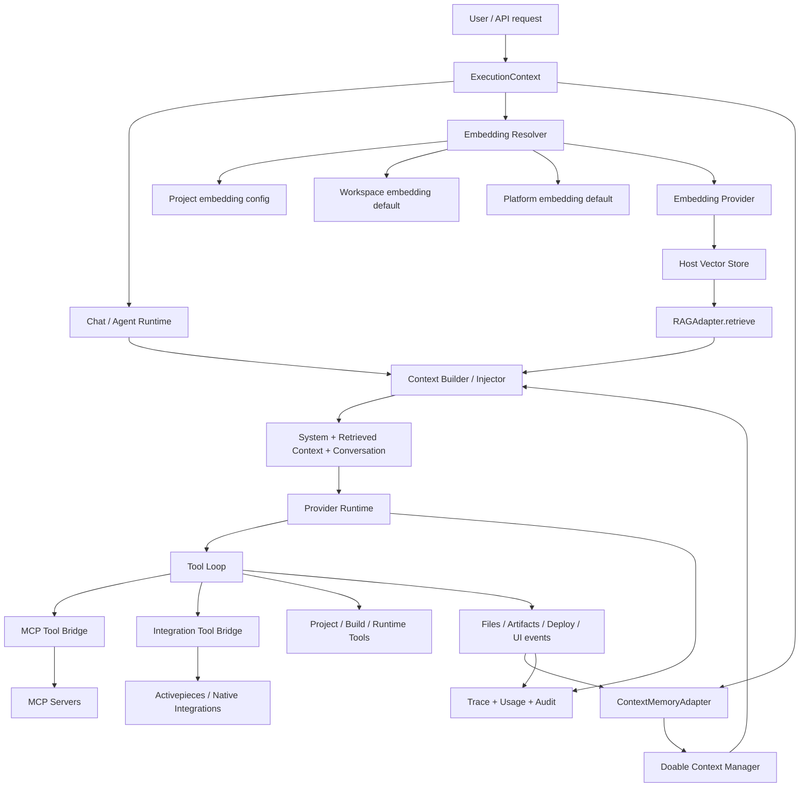

# AI Platform RAG / Context Architecture

## Observed architecture

Doable does not contain one universal vector-RAG implementation in the extracted core. It has three separable layers:

1. **Embedding generation** — `services/api/src/ai/embedding-resolver.ts` resolves project → workspace → platform embedding configuration.
2. **Context / memory** — `services/api/src/context/manager.ts` persists project knowledge files and session memory through Doable's database model.
3. **Host-neutral RAG boundary** — `contracts/rag-context.ts` defines `RAGAdapter.retrieve()` and `ContextMemoryAdapter`, which is the intended seam for Qdrant, pgvector, another vector store, or a host retrieval service.

## RAG graph

## Architectural conclusion

The **RAG contract is portable; the current Doable retrieval implementation is host-bound**. A target host should provide a concrete `RAGAdapter` instead of modifying the immutable Doable AI source. For a Qdrant-based host, Qdrant can supply retrieval while Doable remains the agent/tool/context execution layer.

## Major coupling seams

- `engine-resolver.ts` directly imports Doable SQL, DB queries, encrypted secrets and platform-default routes.
- `engine.ts` directly constructs Doable context managers and reads Doable project paths.
- `embedding-resolver.ts` directly reads Doable SQL and platform config.
- `context/manager.ts` directly reads Doable `environment_knowledge` tables.
- `routes/chat/send-handler.ts` combines provider resolution, context build, tool construction, skill materialization, session persistence, SSE, recovery, tracing, versioning, memory and credits.

Those seams should be replaced by explicit host adapters rather than by editing the immutable source trees.
